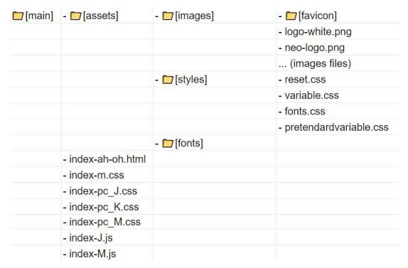
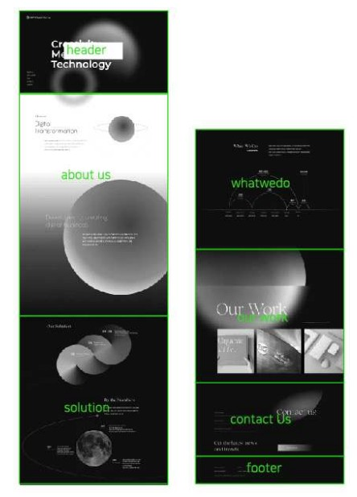

# :love_letter: Team project : Ah-oh

### 웹사이트 리디자인 및 사이트 구현 (반응형 웹사이트 제작)   Making homepage(neo digital group)

> TEAM PROJECT site: [click🌐](https://ah-oh-team-project.github.io/make_neoDG/index-ah-oh.html) 
> git hub site: [click🌐](https://ah-oh-team-project.github.io/make_neoDG/)  
> notion site: [click🌐](https://www.notion.so/Team-Project-Ah-oh-d201d4fcb7a749b3a4d7d144dc31513b)  
> google-sheet site: [click🌐](https://docs.google.com/spreadsheets/d/1yiq65yUBoeE5xjIBpyG7Syw865Bxr23vybb4IEW3J3o/edit?hl=ko#gid=2040591431) 
> google-slides site: [click🌐](https://docs.google.com/presentation/d/1hNUKbtyGXCIqX4KJQZ0BC7rGdM36yLEDdiOziVsSQqk/edit#slide=id.p)  
> NEO Digital Group: [click🌐](http://neodigitalgroup.co.kr/)

## 1. 프로젝트 개요

### 선정 프로젝트 명칭

- Neo Digital Group ([http://neodigitalgroup.co.kr/](http://neodigitalgroup.co.kr/))

## 2. 기획 의도 & 목표

### 사이트 선정 이유

- 수업에서 배운 내용 외 추가로 GSAP를 따로 공부하여 역동적인 애니메이션의 반응형 웹 구현

### 프로젝트 목표

- GSAP와 같은 새로운 플러그인을 공부하며 최대한 기존 사이트와 유사하게 구현.
- Git organization과 Notion을 이용하여 팀원들과의 협업 과정에서 문제없도록 소통.
- 팀 프로젝트의 경험을 통해 작업 속에서 협업이라는 원활한 커뮤니케이션 유지.
- 사이트 구조 분석 및 구현에 따른 작업 진행 시, 코드 분석 능력 향상.

## 3. 작업 순서

1. 요구 분석 및 공통 가이드라인 작성
2. HTML & CSS 각 섹션 작업
3. Javascript & GSAP 작업
4. 오류 개선 작업
5. 발표 & 보고서 작성

## 4. 사용 기술

- 언어 : HTML5, CSS3, JavaScript
- 플러그인 : GSAP
- 사용 프로그램: git / GitHub pages
- 기타 관리 Tool : Notion, Google-sheet, google-slides

## 5. 각 담당 업무

### 역할 분담

|     이름     |                     담당                     |
| :----------: | :------------------------------------------: |
| 한재영(리더) | 깃허브 관리, README 파일 정리, PPT대본 작성. |
| 김민재(팀원) |    이미지 파일 정리, 파일 병합, PPT발표.     |
| 권지민(팀원) |   일정 체크 및 노션 작성 및 관리, PPT제작.   |

### 작업 분담

|  이름  |      담당 작업 파트      |
| :----: | :----------------------: |
| 한재영 |   어바웃과 컨텍트 섹션   |
| 김민재 | 헤더와 푸터, 솔루션 섹션 |
| 권지민 |  왓위두와 아워워크 섹션  |

## 6. 프로젝트 내용

### 퍼블리싱 공통 가이드라인

- 작업 시작 전, 공통 가이드라인을 정한 후 진행하였다.

> 퍼블리싱 가이드라인: [click✅](https://nbviewer.org/github/Hanywyam/neoDGweb/blob/main/%EC%9E%91%EC%97%85%EC%9E%90%EB%A3%8C/231031_%EC%BD%94%EB%94%A9%EA%B0%80%EC%9D%B4%EB%93%9C_ah-oh.pdf)

### 디렉토리 구조

- 원페이지 구성으로 작업 시 페이지 폴더를 따로 구분하지 않고 작업 진행.
- 에셋 폴더에는 폰트, 이미지, 스타일 폴더를 만들어 공통 자료와 파일을 정리.
- 작업 시작 전, 각 개발 도구마다 하나의 파일로 정리하여 진행하려고 하였으나,  파일을 합치는 과정이 원활하지 않아 작업자로 구분하여 여러 개의 파일로 작업 완료.

### 페이지 구성

- ①header / ②about / ③solution / ④what we do / ⑤our work / ⑥contact /
  ⑦footer 총 7개의 메인 페이지를 섹션별로 나눠 작업 진행.

### 작업 시 문제 및 해결

**1. [about us] page**

- **문제 ①**  원작의 애니메이션이 GSAP를 이용하여 각자의 움직임으로 훨씬 복잡하게 표현하였으나 구현의 어려움.

- **해결방안**

  - 동일하게 구현하는 데는 현재 역량으로 한계가 있었다. 대신, 효과를 단순화하여 표현하는 것으로 해결

- **문제 ②**  헤더에서 어바웃 첫 페이지까지 자연스럽게 넘어가는 효과를 주었는데, 그라디언트 값으로 해결하기에는 자연스럽지 않았다.

- **해결방안**
  - 두 섹션 사이에 새로운 배경 영역을 div로 추가.
  - GSAP를 이용하여 스크롤 배경 효과를 적용하였다.

**2. [contact us] page**

- **문제 ①**  값의 유무에 따라 알림창을 다르게 뜰 수 있도록 if 문을 이용하여 자바스크립트 코드를 작업하였으나, false 값만 출력됨.

- **해결방안**

  - 처음에는 input만 선언하여 작업하였으나, 모든 input의 아이디를 선언하여, 세 개의 입력값 중 하나라도 빈 문자열이 있는 경우로 확인하도록 작성하여 해결하였다.

- **문제 ②**  placeholder 상태에서 input 값을 입력했을 때 글자 색상이 변해야 하는데, 설정하지 않은 placeholder의 색상까지 값이 적용되었다.

- **해결방안**
  - input 기본값에 컬러를 설정하여 placeholder의 기본값을 유지.

## 7. 프로젝트 완료 리뷰

### 발표 Q&A

> ❓: 솔루션 페이지 점선을 어떤 방법으로 작업한 것인지? 
> ❕ : SVG 이미지를 활용하여 CSS style 값으로 애니메이션 효과를 주어 작업했다.

> ❓: 새로운 플러그인 중 가장 어려웠던 부분은? 
> ❕ : 원작에서 표현한 객체별 자유로운 애니메이션을 구현하기가 어려웠다. 이 부분은 작업하면서도 표현이 어려워 단순화하여 작업했다.

> ❓: 가로 스크롤이 넘친 부분이 어느 곳인지, 지구본 궤도로 인해 가로 값이 넘친 것인지? 
> ❕ : 지구본 궤도를 넣기 전부터 영역이 넘쳤고, 히든이나 박스사이징을 넣으면 GSAP를 사용하기 어려워서 프로젝트 완료까지 해결하지 못했다.

> ❓: 그래프는 이미지인지 직접 CSS로 작업한 것인지? 
> ❕ : background-color에 gradient 값을 주어 표현했다.

> ❓: 지구본 궤도는 어떤 방법으로 작업한 것인지? 
> ❕ : SVG 이미지를 transform을 이용하여 각도와 로테이션 값으로 애니메이션 효과를 주었다.

### 발표 피드백

- **아쉬운 부분**
  - 일부 겹치는 내용으로 인한 PPT의 구성이 아쉬움.
  - 원본 사이트나 작업물을 보여주기만 하는 부분은 생략하고 설명과 함께 보여주는 게 좋음.
  - PPT 안에 내용이 다소 많음. 요구사항의 경우, 강조해야 할 부분만 요약하여 간략하게 발표하는 것이 좋았을 것 같다.
- **잘한 부분**
  - 업무분담이나 협업에 관한 내용이 팀 작업을 진행하며 원활하게 소통하며 진행한 부분이 보였다.
  - 협업이라는 팀 작업에서 이 부분이 강조되어 좋았다.

## 8. 팀 프로젝트를 마치며

### 아쉬운 부분

- 원작 사이트에서 이용한 애니메이션 효과를 완벽하게 구현하지 못함.
- 처음 진행한 팀 작업으로 가이드라인을 정하고 시작했음에도 서로 규칙을 지키면 작업하기 어려웠음.

### 잘한 부분

- 처음 보는 플러그인을 이용해 사이트 제작을 진행한 점.
- 잘 알지 못했던 부분을 해결하기 위해 수업에서 배웠던 예제나 인터넷에서 많이 찾아보며 해결해보려고 노력했다.

### 최종 리뷰 (배운점 및 주관적인 의견)

- 첫 프로젝트로 시작했을 때는 살짝 두려웠지만, 작업을 진행하면서 점차 구현되는 작업물을 보며, 내심 뿌듯했다. 첫 팀 프로젝트였음에도 함께 작업하는 것에 서로 이해하고 배려하며 진행되었다. 팀 프로젝트가 끝날때까지 모든 진행 과정에서 작은 트러블조차 없이 원활하게 작업을 마칠 수 있었다.
- 처음 프로젝트 시작할때 만든 가이드라인이 있음에도 각자 작업하면서 규칙이 틀렸다. 다음 팀 작업 시에는 더 구체적인 가이드라인을 구축한 뒤, 서로 정확하게 공유가 된 상태에서 작업이 진행되는게 좋겠다는 생각이 들었다.

# :boom: Project Timeline

 프로젝트 타임라인 정리 [접기/펼치기]

## 23.11.13 [발표 및 보고서 제출]

## 23.11.10 [작업 마무리 및 발표 준비]

## 23.11.08 [작업 중간점검]

###### j(재영)

- **어바웃**
  - 헤더에서 넘어올때 배경 자연스럽게 만들기
  - 배경 원 등장 애니메이션 적용하기
- **컨텍트**
  - pc버전 효과 다시 수정하기
  - 버튼 안눌리는 것 수정하기

###### K(민재)

- **헤더**
  - 메뉴 고정?(모바일+중간값)
  - 헤더 메뉴바 fix 고정으로 미디어쿼리 적용 필요 (px)
- **솔루션**
  - 중간값 미디어쿼리 작업
  - 핀 고정
  - 넘버(지구) 주황 선

###### M(지민)

- **왓위두**
  - 페이지 넘침 해결하기
- **워크**
  - 터치 슬라이드 선택 영역 넓히기
  - pc 이미지 사진 줄이기
  - 모바일 이미지 여백값 줄이기

## 23.11.06

###### j

- 미디어 쿼리 적용 시, flex 정렬이 제대로 인식되지 않아 컨텐츠 정렬에 문제가 생김.
- 그리드로 변경하여 정렬 시도.

###### K

- 배경의 circle 블러 효과 처리에 어려움이 있었으나 필터 효과를 적용하여 해결.
- 애니메이션으로 컨텐츠 움직임 해결.

###### M

- what we do 컨텐츠 고정되지 않음.

## 23.11.05 미팅 [14:00 오산대역 할리스 DT점]

- [x] html, 모바일버전 css 작업 완료.
- [x] 파비콘, og 적용 완료.
- [x] html, 모바일버전 css 파일 하나로 정리 == index-m.css
- 미디어쿼리 작업 진행 시 파일명 : index-pc\_$.css ($ == 본인 이름 대문자명)
- 미디어쿼리 작업 M-T-PC 무조건 오늘 안에 마무리 (내일 수업 전까지 꼭!!)
- 내일 오후 팀 작업 시간부터 JS, GSAP(마우스이벤트) 어떻게든 작업해보기.
- 각자 맡은 영역 화요일까지 해보고, 안되는 부분은 다같이 수요일부터 작업해보기.
- 목요일은 발표준비까지 생각하고 작업해야 할 듯.

#### 23.11.05 [작업 중간점검 수정사항]

###### 헤더

- 로고 이미지 추가 필요
- 로고 텍스트 크기 조절 필요할것같아요
- 메뉴바 누르면 서브메뉴 없음
- 공통 서체 적용 안됨
- 배경 circle 그라데이션 다시
- menu 아이콘 메뉴 선택 시 화면이 유지되지 않고 깜빡거리며 사라짐
- menu 아이콘 메뉴 선택 시 검은 background 슬라이드가 내려와야함

###### 메인 1-1

- pc 사이즈 작업 필요

###### 메인 1-2

- 배경 circle 사이즈 줄여서 넘치지 않게 하기

###### 메인 2-1

- 공통 서체 적용 안됨
- 라인 각도가 다 같아서 서로 다르게 적용 필요
- 라인이 이미지 밑으로 갈수 있게 z-idex 정리
- 모바일이상 사이즈에서 정렬이 안맞음

###### 메인 2-2

- 공통 서체 적용 안됨
- 모바일이상 사이즈에서 정렬이 안맞음

###### 메인 3

- 모바일이상 사이즈에서 정렬이 안맞음

###### 메인 4

- 모바일이상 사이즈에서 롤링 이미지 사이즈 크기 작음

###### 메인 5

- 모바일이상 사이즈에서 푸터랑 영역 겹침
- pc 사이즈 작업 필요

###### 푸터

- adress 정렬이 안맞음
- p margin left 값 없애기

###### 클래스명 가이드라인과 다르게 정리가 잘 되지 않음.

###### _css 공통으로 맞춰야하는 사항_

###### j

- 제목 및 텍스트 요소 width: 90vw;/ margin: 0 auto;

###### K

- 제목 및 텍스트 요소 width: 80% / margin: 0 auto;
- solution section 제목요소 margin-left 20px

###### M

- 제목 및 텍스트 요소

## 23.11.01~04

#### 문제점 발생

1. 각자 작업한 부분 중 일부 js가 제대로 작동하지 않음.
2. 폰트가 연결되지 않아 디자인적으로 다소 부족함.
3. 현재까지 작업 파일 합친 후, 레이아웃 규격이 넘치고 정렬이 흐트러짐.
4. 헤더가 보였다 숨겼다 하는 문제가 발생.
5. 가이드라인으로 맞추기로한 클래스명이 생각보다 정리가 되지 않음.

#### 해결 방법

1. - [x] 누락된 외부 링크 찾아 다시 연결.
2. - [x] variable.css 사용해서 폰트 연결 및 코드 정리.
3. - [x] 넘치는 이유 찾아서 수정 진행.
4. - [ ] z-index를 이용하여 정리해보았으나, GSAP와 충돌로 해결이 안됨.
5. - [ ] 다시 정리해보려고 했는데 이미 작업 진행중인 상태에서 해보려니 코드가 너무 꼬여서 수정없이 진행하기로 함.

#### ~11/4까지

- 모바일버전 css 각자 최대한 완벽하게 작업 완성
- variable.css 사용해서 폰트 정리
- PC까지 css 미디어쿼리 완성
- 사이즈는 vw -left, right / vh - top,buttom 같은 단위로 작업
- 큰 영역에 px 같은 고정 값 없애기
- 나눠서 작업한 파일이 있으면 합치기(1인당 css, js 파일 1개씩)
- 개인 파트에 맞춰서 필요한 gsap 찾아서 공유&공부해오기

#### 11/5 [팀 미팅]

- 각자 설정되어있는 z-index 순서 정리하기
- 합친 파일에서 문제생기는 오류 찾아서 코드 정리 및 수정
- js 작업 진행. 플러그인 gsap 스크롤 이벤트 추가 작업

#### 다음주차부터 각 파트 부족한 JS 작업 진행 할 예정

- 각자 섹션별 css, javascript 작업 진행.
- 맡은 영역 최대한 웹사이트와 동일하게 구현 완성 목표로 작업.

## 23.10.31

- 각자 섹션별 css 작업 진행
  - css 작업 마무리 되는대로 모여서 정리 진행하기로 결정.
- index.html 각자 파트 작업 병합 및 index 큰섹션 (header/main/footer) 이용해서 정리하기.
- html W3 유효성 검사 완료.
- 퍼블리싱 가이드 작성 수정사항 -> develop 완료.

- assets 폴더 정리하기
  - font.css : font는 총 3개로 정리.
    - 영문 폰트 : ① 'Archivo', sans-serif / ② 'Playfair Display', serif
    - 한글 폰트 : ③ 'Pretendard Variable', sans-serif
  - variable.css
    - 23.10.31 : 폰트만 설정
- variable.css 같이 의논해서 정리하기 -> 현재 섹션마다 사이즈가 너무 상이해서, 추후 각자 css 작업 완료 후 병합 시 변수로 사이즈 통일 정리하기로 함.

## 23.10.30

- index.html 작업 진행.
- 퍼블리싱 가이드 작성.
  [231030\_코딩가이드\_ah-oh.pdf](https://ah-oh-team-project.github.io/make_neoDG/%EC%9E%91%EC%97%85%20%EC%9E%90%EB%A3%8C/231031_%EC%BD%94%EB%94%A9%EA%B0%80%EC%9D%B4%EB%93%9C_ah-oh.pdf)

## 23.10.27

- 퍼블리싱 사이트 구조 분석.
- 사이트 구축 요구사항 정리.
  [231026\_요구사항+구조분석.pdf](https://ah-oh-team-project.github.io/make_neoDG/%EC%9E%91%EC%97%85%20%EC%9E%90%EB%A3%8C/231026_%EC%9A%94%EA%B5%AC%EC%82%AC%ED%95%AD+%EA%B5%AC%EC%A1%B0%EB%B6%84%EC%84%9D_ah-oh.pdf)

## 23.10.26

- 팀 프로젝트 목표 설정.
- 사이트 구조 분석 및 작업 역할 분담.
- 팀원별 맡은 영역에 대한 퍼블리싱 가이드 분석.

### 목표

1. 플러그인 GSAP를 공부하여 최대한 기존 사이트와 유사하게 구현 할 수 있도록 한다.
2. git organization을 이용한 협업을 통해 팀원들과의 협업이 문제없이 이루어지도록 하는 것을 목표로 한다.
3. 팀 프로젝트 경험을 통해 원활한 커뮤니케이션 능력을 키운다.

### 선정 사이트

[NEO Digital Group](http://neodigitalgroup.co.kr/)

### 사이트 선정 이유

- 이번 팀 프로젝트를 통해 수업 외 새로운 플러그인을 추가로 공부하며 작업하고 싶었다.

### TEAM: ah-oh

- 팀장: 한재영
- 팀원: 김민재, 권지민

- 역할분담

  - Github 관리: 한재영
  - notion 관리: 권지민
  - 자료(site text&img) 관리: 김민재

- 웹사이트 제작 역할 분담
  - 메인페이지 총 6개의 섹션을 난이도별로 나눠, 상-중, 하 순으로 2part씩 작업 분담.
    - 한재영: about / contact
    - 김민재: header+footer / solution
    - 권지민: what we do / our work

